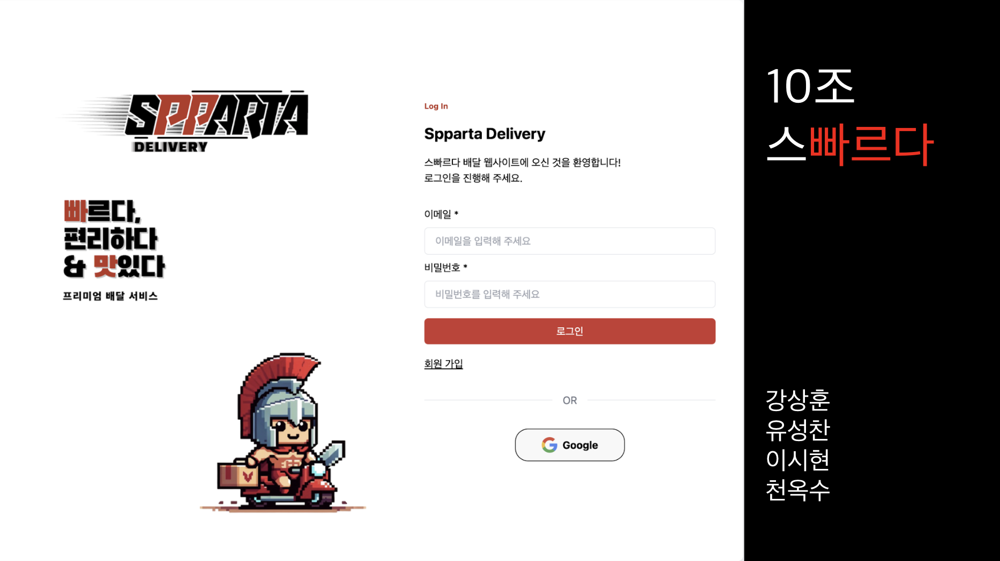
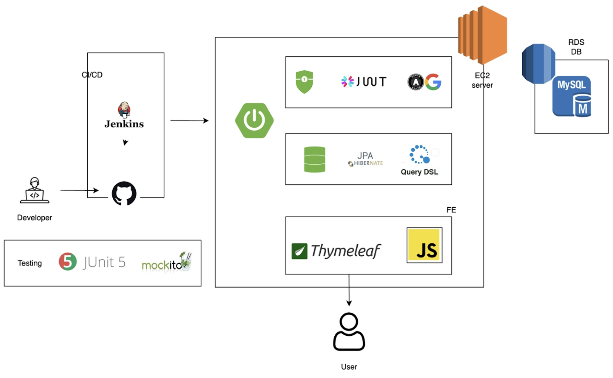
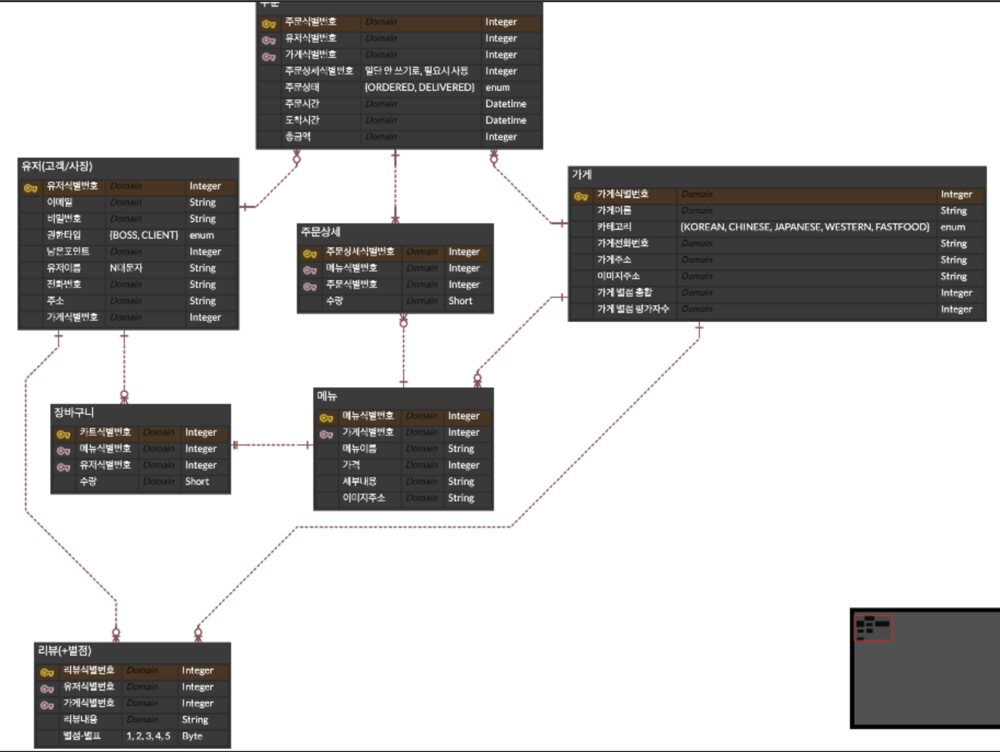

# 스빠르다(SpartDelivery)

- 배달 앱 클론 코딩 프로젝트

### 📆 프로젝트 기간

- 2024/03/15 ~ 2024/03/25

### 📚 기술 스택

- FE
  - HTML
  - CSS
  - Javascript
- BE
  - Java 17
  - Spring Boot 3.1.10
  - Spring Boot Data Jpa
  - Spring Boot Security
  - Spring Boot Thymeleaf
  - AWS EC2, RDS, S3
  - MySQL
  - OAuth 2.0
  - JWT
  - Jenkins

### 💡 주요 기능

- 회원가입/로그인(시큐리티),
- 이메일인증, OAuth, Refresh토큰
- CRUD

### 🏗️ 서비스 아키텍쳐

### ERD

### 트러블 슈팅

- AWS Freetier 성능 이슈

  - Jenkins는 구동하기 위한 별도의 서버가 필요
  - Freetier서버에 Spring + Jenkins를 동시에 실행 후 웹 훅이 발생했을 때 서버 다운
  - 젠킨스는 별도의 서버(로컬)로 변경, EC2에는 스프링 서버만 구동

- 이메일 인증 라이브러리 버젼 이슈

  - Java 17 이후 이메일 인증 라이브러리가 javax에서 jakarta로 변경

- 통합 검색 구현
  - 사용자가 어떤 검색어로 검색을 하면 카테고리, 가게명, 주소 중 하나라도 검색어를 포함하고 있는 데이터를 조회하는 기능을 구현하고자 하였음.
  - 각각의 검색어로 fetch하여 list 를 append 하는 로직으로 구현할 경우, 순서보장, 중복 제거, pagination 의 문제가 발생.
  - Querydsl 도입
